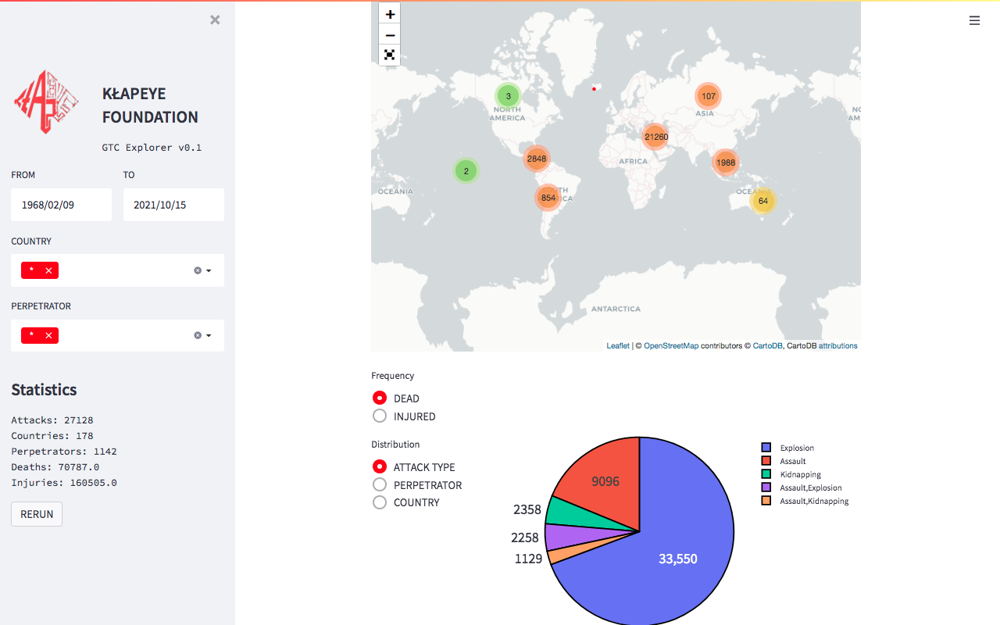

# GTC Explorer | Catalogue of Terrorist Incidents occurred globally since 1968.

## Instructions for running
1. Install requirements with `pip3 install -r requirements.txt`.
2. Run with `streamlit run gtc.py`.

**FEEL FREE TO SUBMIT PULL REQUESTS**
