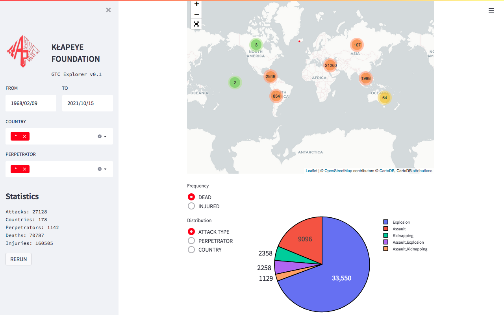
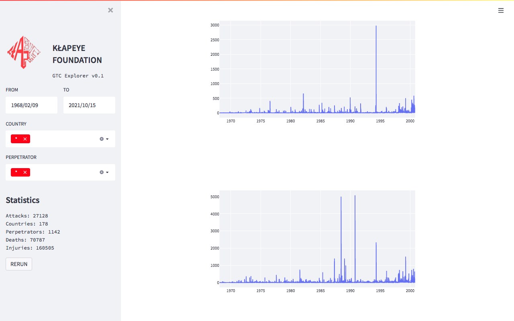
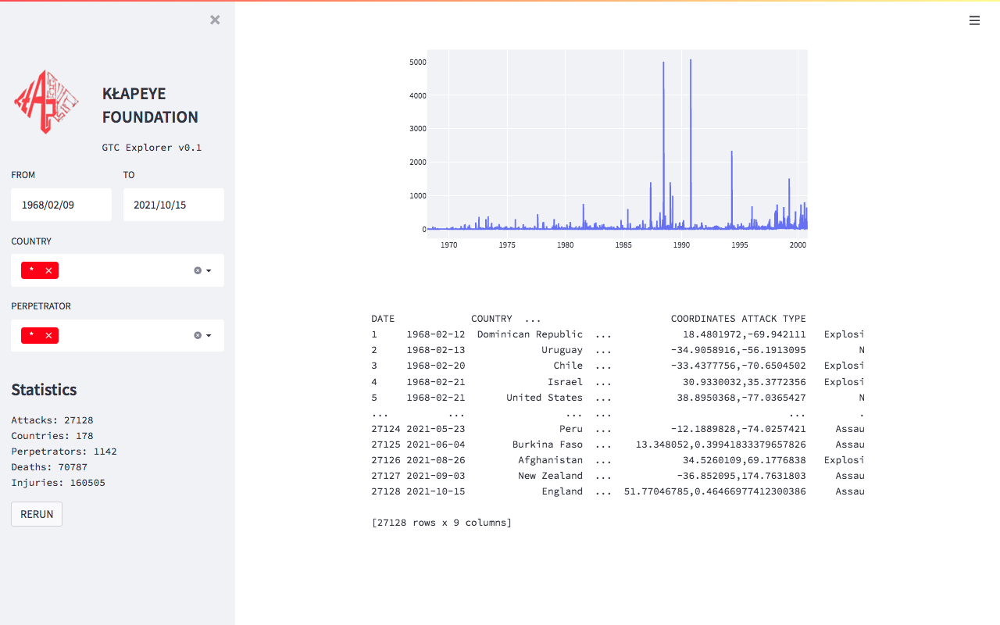

# GTC Explorer | Global Terrorism Catalogue Explorer

## Instructions for running
1. Install requirements with `pip3 install -r requirements.txt`.
2. Run with `streamlit run gtc.py`.

[Kaggle Dataset](https://www.kaggle.com/datasets/klapeyefoundation/global-terrorism)

**FEEL FREE TO SUBMIT PULL REQUESTS**

## Screenshots

